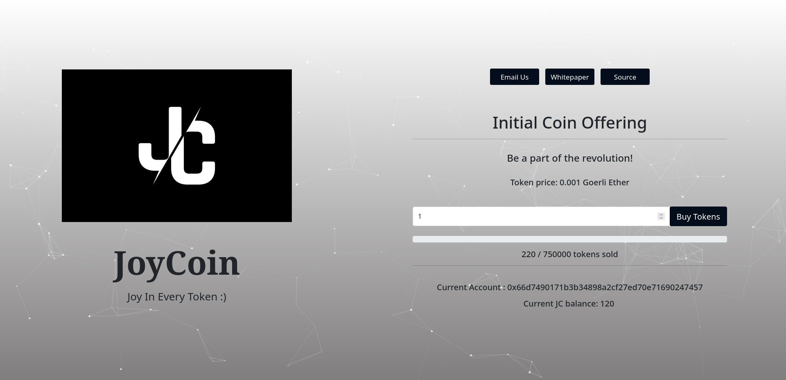

## About

This project is a complete implementation of Ethereum's [ERC-20 token standard](https://github.com/ethereum/EIPs/blob/master/EIPS/eip-20.md)  on the [Rinkeby test network](https://www.rinkeby.io/#stats), along with a hosted [ICO website](https://njwardhan.github.io/JoyCoin/) for the same.

## Project screenshot

## Steps to purchase

* Visit the project website
* Connect your Ethereum wallet (Metamask) to the website (make sure that the Rinkeby testnet is selected)
* Enter the number of JCs to be purchased
* Spend Rinkeby fake ethers (token price, gas fee) to complete the transaction
* Gain ownership of some JoyCoins :)

## To-do

* Frontend can be bettered
* Mainnet deployment with a proper project format

